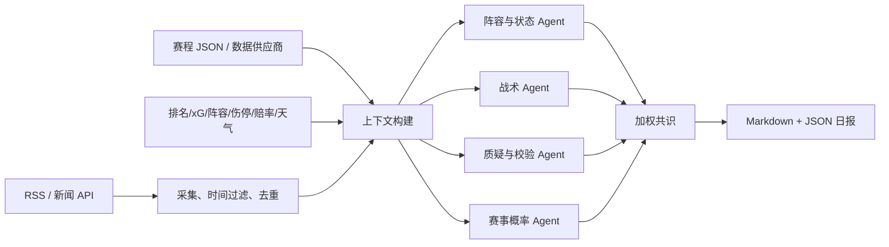

# World Cup Forecast Agent Cluster

一个每天聚合新闻和结构化足球数据、调用多个厂商大模型、预测下一场
世界杯比赛胜方与比分，并生成中文 Markdown/JSON 日报的 Python MVP。

## 架构



支持三类真实厂商接口：

- `openai_compatible`：OpenAI 及提供 Chat Completions 兼容接口的厂商
- `anthropic`：Anthropic Messages API
- `gemini`：Google Gemini generateContent API
- `mock`：无 Key 的本地端到端演示

## 快速开始

```bash
python3 -m venv .venv
source .venv/bin/activate
pip install -e ".[dev]"
cp config.example.yaml config.yaml
cp .env.example .env
world-cup-forecast --config config.yaml
```

报告生成在 `reports/YYYY-MM-DD.md` 和 `reports/YYYY-MM-DD.json`。

## 接入厂商模型

1. 在 `.env` 写入厂商 API Key。
2. 在 `config.yaml` 启用对应 provider，填写厂商当前可用的模型名。
3. 把 Agent 的 `provider` 从 `demo` 改为对应 provider id。
4. 可以让不同角色使用不同厂商，降低单模型偏差和单点故障。

兼容厂商若不支持 `response_format: {"type": "json_object"}`，可在
`providers.py` 中移除该字段，系统仍会尝试从回复中提取 JSON。

## 每日执行

服务器 cron 示例，每天北京时间 08:00 运行：

```cron
0 8 * * * cd /path/to/project && .venv/bin/world-cup-forecast --config config.yaml >> logs/daily.log 2>&1
```

生产环境建议使用容器定时任务、GitHub Actions、Airflow 或云厂商 Scheduler，
并将 Key 放入 Secret Manager，不要提交到 Git。

## 数据说明

`data/fixtures.example.json` 只是演示赛程。生产环境应替换为有授权的赛事数据源，
每日同步赛程、开球时间、比赛状态、阵容、伤停和赛果。新闻 RSS 也应按许可条款使用。

`data/match_intelligence.example.json` 定义了统一的结构化比赛数据格式，覆盖：

- 最近比赛结果、进球、失球、xG、xGA、射门
- FIFA 排名、Elo、主客场胜率、零封率和休息天数
- 预计/确认首发、伤病、停赛和球员重要性
- 历史交锋和多个时间点的胜平负赔率
- 天气、场地、草皮、海拔、旅行距离和时差

示例文件中的数值全部是演示数据，并非实时事实。

## 接入实时结构化数据

在 `config.yaml` 的 `data_sources` 中启用 `http_json`：

```yaml
data_sources:
  - id: realtime_football_data
    type: http_json
    url: https://your-data-service.example.com/match-intelligence
    api_key_env: FOOTBALL_DATA_API_KEY
    api_key_header: X-API-Key
    api_key_prefix: ""
    enabled: true
```

系统会向 URL 发送 GET 请求，并附加 `match_id`、`home_team`、`away_team`
和 `kickoff` 参数。返回值必须符合
`data/match_intelligence.example.json` 的结构。可以同时配置多个数据源，系统会合并：

- 足球统计供应商：赛果、排名、xG、射门、阵容、伤停和交锋
- 赔率供应商：不同时点的欧赔快照
- 天气供应商：开球时段天气
- 自有服务：场地、旅行距离和时差

API Key 写入 `.env`：

```env
FOOTBALL_DATA_API_KEY=你的数据服务Key
```

每次运行会打印结构化数据完整度，日报也会列出缺失因素。缺失数据不会由模型编造。

模型输出不是可靠事实，也不构成博彩建议。比分属于高方差预测，报告同时保留胜/平/负
概率和 Agent 一致度，不能只展示单一比分。

## 推荐的生产增强

- 保存每次预测和最终赛果，计算 Brier score、log loss、校准曲线
- 按历史准确率动态调整 Agent 权重，而不是永久人工设权
- 增加来源可信度、同源转载识别、事实冲突检测和人工审批
- 增加邮件、企业微信、飞书或 Slack 分发
